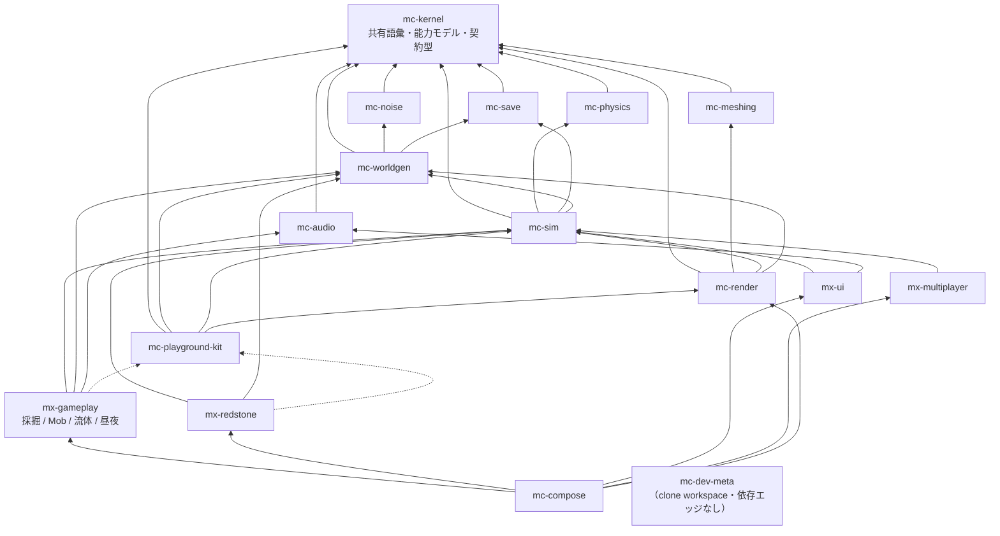

# アーキテクチャ

出典: plan.md §2。本書は plan.md の構成を **mx-gameplay の席から**読み直し、
`scripts/check-dependency-whitelist.ts` と `test/stage-registration.test.ts` が機械的に強制している内容と対応づけたもの。

## 1. 4 階層

単一リポジトリ（参照実装 84k LOC）では「正しく動くことが保証される単位」が大きすぎた。
そこで**ゲーム UX を構成する体験単位ごとにリポジトリを分け、各リポジトリが単独で「テスト green + プレビューで目視確認済み」を閉じる**構成を採る。

| 階層 | リポジトリ | 性質 |
| --- | --- | --- |
| 安定ライブラリ | `mc-kernel` / `mc-noise` / `mc-meshing` / `mc-physics` / `mc-save` / `mc-audio` | 純粋関数・狭い界面・変更頻度が低い。相互独立で並行構築可能 |
| 基盤 | `mc-worldgen` / `mc-sim` / `mc-render` / `mc-playground-kit` | 状態とサービス（**名詞**）。体験モジュールが乗る土台 |
| 体験モジュール | **`mx-gameplay`** / `mx-redstone` / `mx-ui` / `mx-multiplayer` | ルールと UI（**動詞**）。互いを知らず、基盤サービス経由でのみ会話する |
| 合成 | `mc-compose` | Layer マージ + stage 順序表 + E2E。ロジックを持たない |

これに開発用の `mc-dev-meta`（15 リポジトリを `repos/` に clone して 1 つの pnpm workspace として束ねる薄いリポジトリ、
plan.md §6 Step 0）を加えて 16。`mc-dev-meta` はパッケージ依存エッジを一切持たない — clone 置き場である。

## 2. 依存グラフ（全 16 リポジトリ）

実線 = 実行時依存（`dependencies`）、点線 = プレビュー起動時のみ（`devDependencies`）。



エッジ集合は plan.md §2.1 の逐語再掲である。plan.md がそうしているとおり、
kernel へのエッジは基盤の段までしか描かれていない。作図上の都合であり、依存規則としては
**「kernel はどの行にも書かない」**が正しい — `mc-kernel` はどこからでも import 可なので、
`REPOSITORY_POLICY.dependencyGraph` にも一切書かれていない
（`checkPolicyConfiguration()` が kernel を含む行を設定エラーとして拒否する）。

同じ理由で `mx-gameplay -.-> kit` の点線も `dependencyGraph` には存在しない。
kit は実行時エッジではないため、載せてしまうと `kit → render → sim` と `gameplay → sim` により
**循環に見えてしまう**。kit は `DEV_ONLY_PACKAGES` として別枠で扱う。

`test/check-dependency-whitelist.test.ts` の
`carries the complete 16-repository roster, so cycle detection can see the whole organisation` が
「16 行あること」と `checkPolicyConfiguration()` が空を返すことを検査している。

## 3. 名詞/動詞ルール — このリポジトリの中心規則

> **基盤 = 名詞、体験 = 動詞。**（plan.md §2.3-1）

`InventoryService` のような**状態の置き場**は基盤に、「掘ったらドロップする」という**ルール**は体験に置く。

**mx-gameplay は動詞である。** これは比喩ではなく、何をここに書いてよいかの判定規則そのものである。

| 名詞（ここには置かない） | 実際の置き場 | 動詞（ここに置く） |
| --- | --- | --- |
| `InventoryService` — 誰が何を何個持っているか | `mc-sim` | 「掘ったらドロップしてインベントリに入る」 |
| `EntityManager` — どの Mob がどこにいるか | `mc-sim` | 「クリーパーはプレイヤーに近づくと起爆する」 |
| `TimeService` — 今が何時か | `mc-sim` | 「夜になったら Mob がスポーンする」 |
| `ChunkManager` — どのチャンクがロード済みか | `mc-worldgen` | 「砂は支えを失うと落ちる」 |
| `HealthService` — 体力がいくつか | `mc-sim` | 「溶岩に触れたら燃える」 |
| `SoundCuePort` — どの音をどう鳴らすか | `mc-audio` | 「ブロックを壊したら音を鳴らす」 |

判定手順は 1 つで足りる。**「セーブファイルに要るか」を問う。** 要るなら名詞であり、ここには置かない。
`stages/registration.ts` の `GameplayFrameState` が `Ref` を 5 本持っているのはこの規則の例外ではなく、
規則を通過した結果である — 落下ブロックのキュー、流体のフロンティア、tick カウンタは
「次に何を見るか」というメモであって、ワールドの事実ではない。セーブファイルには要らない。

残る 2 本（`pendingBreaks` / `minedItems`）はブロック書き込みの配線と一緒に来たもので、
**動詞の入口と出口**である。今フレームの破壊要求と、掘れたブロックが mc-sim の `InventoryService` に
渡るまでの 1 フレーム幅の置き場であり、どちらも同じ判定手順を通っている
（セーブファイルは「ブロックが無い」ことを記録するが「ボタンが押されていた」ことは記録しない）。
**ブロックそのものは 1 つも持っていない。** 読み書きはすべて mc-worldgen の `ChunkStore` を通る —
世界のコピーをここに置いた瞬間に、この節の規則は破られる。
詳細と各 `Ref` の判定は [public-api.md](./public-api.md) §5。

### 3-1. 昼夜——この規則が実際に適用された 1 例

**この規則は一度破られていた。** `stages/registration.ts` は `timeOfDaySecs` と `dayLengthSecs` の
`Ref` を持ち、`gameplay:time-weather` stage でそれを進めていた。既定の日長は 1200 秒で、
**mc-sim の 400 秒と食い違っていた**。

セーブファイルは確実に時刻を要る。だから上の判定手順に従えば、これは最初から名詞であり、
`mc-sim/domain/time-of-day.ts`（`application/time-service.ts` の背後、順序ハザードごと）が既に所有していた。
**1 つの名詞に 2 人の所有者がいる状態は「今何時か」に 2 つの答えがある状態**であり、
セーブされるのは mc-sim の答えだけなので、食い違いはワールドロード時に空が飛ぶ形で表面化する。
このファイルのヘッダも本書の当節も、当時から「mc-sim が所有する」と書いていた。**コードだけが違っていた。**

削除されたのは状態であって、ルールではない。残ったのが `domain/day-night.ts` である。

| | 置き場 | 実体 |
| --- | --- | --- |
| **名詞** — 今何時か | `mc-sim` | `TimeState`（絶対 tick + 分母）、`timeOfDay`、`advance`、`setDayLength`、`configureDay` |
| **動詞** — その時刻に世界が何をするか | **`mx-gameplay`** | `isNight` / `dayPhase` / `hostileSpawnsAllowed` + 分数定数 |

`domain/day-night.ts` の関数は**すべて「1 日の位置」という 1 引数の全域関数**である。
`Ref` も、既定の日長も、順序制約も無い。同期すべきものが無いので、
mc-sim と mx-gameplay が別リポジトリであることが問題にならない。
唯一二重に書かれているのは `isNight` の境界（0.25 / 0.75）で、
**両方のリポジトリがそれを書き、両方がテストで固定している** —
スポーン規則と、その規則が適用される状態とが、夜の定義について合意していなければならないからである。

回帰テスト:
`REGRESSION: the frame state holds no time of day and no day length`（`test/stage-registration.test.ts`）、
`REGRESSION: exports no day-length default and no way to advance the clock`（`test/public-api.test.ts`）、
`is the half of the day centred on the 0/1 boundary, exactly as mc-sim computes it`（`test/day-night.test.ts`）。

この線引きを緩めるとどうなるかは参照実装が実演済みで、
合成層に 13k LOC のルールが堆積して E2E でしか検証できなくなった（plan.md §3.15）。
「あと 1 本 `Ref` を増やすだけ」がその経路である。

### 3-2. クリーパー——上の表の 2 行目が実装された例

§3 の表は `EntityManager`（名詞、mc-sim）に対して
「クリーパーはプレイヤーに近づくと起爆する」（動詞、ここ）を並べている。
その動詞が `domain/mob/` の 7 ファイルとして実在するようになったので、線の引かれ方を実物で確認できる。

| | 置き場 | 実体 |
| --- | --- | --- |
| **名詞** — どの Mob がどこにいて体力がいくつか | `mc-sim` | `EntityManager`。セーブファイルが要る |
| **動詞** — その配置のとき Mob が何をするか | **`mx-gameplay`** | `stepCreeperFuse` / `canHostileSpawnAt` / `explosionDamageAt` / `rollMobDrop` / `endermanTeleportUrge` / `stepShulkerShell` / `despawnVerdict` |

エンダーマンのテレポートは、この線がどこまで引けるかの一番きわどい例である。
「どこへ跳ぶか」は一見すると位置の話だが、参照実装が**自分の位置を使っていない**ため
（`enderman-teleport.ts:28`）位置は約分され、残るのは**変位**——値から値への関数——だけになる。
`endermanTeleportOffset` は `{xBlocks, zBlocks}` を返し、それを何に足すかは知らない。
逆にドラゴンは絶対ワールド Y と速度で書かれているので、同じ分割ができず、
アリーナの missing 一覧に**拒否**として載っている（docs/porting.md §5-2）。

判定手順は §3 と同じ 1 つで足りた。**「セーブファイルに要るか」** ——
クリーパーの位置と体力は要る（だから mc-sim）。「3 ブロック以内なら着火する」は要らない（だからここ）。
導火線の残り時間だけが微妙に見えるが、これも答えは出る:
**要るのは Mob であって、導火線はその Mob のフィールド**である。
だから `CreeperFuse` は `domain/death-cause.ts` の `Vitals` と同じ立場の**値**であり、
ホストが持ってルールに渡す。`Ref` は 1 つも増えていない。

帰結が 2 つある。

1. **`gameplay:entities` はまだクリーパーを 1 行も回していない。** 回すには名簿の反復が要り、
   名簿は mc-sim のものだからである。ここに `Ref<Map<MobId, CreeperFuse>>` を置けば今日動くが、
   それは §3-1 が記録した `timeOfDaySecs` と**同じ間違い**——1 つの名詞に 2 人目の所有者——になる。
2. **ホスト役はプレビューが務めている。** `apps/preview-mining-site` のアリーナ画面が持っているのは
   距離 1 つと `CreeperFuse` 値 1 つで、それが mc-sim が持つことになるものの全部である。
   ルール側の型（`CreeperSenses` はフィールド 1 つ）が、その費用を読める形にしている。

## 4. 体験モジュール間のエッジがゼロである理由

グラフ上、`mx-gameplay` / `mx-redstone` / `mx-ui` / `mx-multiplayer` の 4 行の間には**エッジが 1 本もない**。
これは偶然そうなっているのではなく、この構成が成立するための条件である。

### 4-1. 「採掘 → インベントリに入る」はエッジではない

一見すると `mx-gameplay` が `mx-ui` のホットバーを更新したくなる。実際に起きるのはこうである。

```
mx-gameplay  --(write)-->  mc-sim: InventoryService  <--(read)--  mx-ui
```

`mx-gameplay` は「インベントリにアイテムを 1 個足す」とだけ言う。それが画面に出るかどうかは知らない。
`mx-ui` は `InventoryService` を購読しているので、誰が書いたかを知らずに更新される。
**両者は共通の名詞を知っているだけで、互いを知らない。**

### 4-2. このルールが防いでいる壊れ方

エッジを 1 本許すと、4 モジュールは高い確率で「循環していないメッシュ」になる。
`gameplay → ui`、`redstone → ui`、`ui → multiplayer`、`gameplay → redstone` — どれも循環ではないので
循環検査は通る。しかしこうなった時点で、**4 つのうちどれ 1 つも単独では検証できなくなる**。
`mx-gameplay` のテストを回すのに `mx-ui` の実装が要り、`mx-ui` を直すと `mx-gameplay` の CI が落ちる。

それは 16 リポジトリに分けた意味が消えた状態であり、名前が 4 つある一枚岩である。
本計画の出発点が「84k LOC の単一リポジトリでは正しさを検証しきれない」（plan.md §1）だったので、
これは失敗のうちで最悪のもの — 分割のコストだけ払って利得を失う — にあたる。

だから禁止は「循環しないこと」ではなく **「エッジが 1 本も無いこと」** である。前者は緩すぎる。

### 4-3. ゲートは 2 つあり、別の穴を見ている

**(a) import ゲート — `scripts/check-dependency-whitelist.ts`**

`REPOSITORY_POLICY.dependencyGraph` の `mx-gameplay` 行に兄弟が書かれていないので、
`import … from '@nerima-games/mx-ui'` は `not-whitelisted` で落ちる。特別扱いは要らない。

固定しているテスト:
`REGRESSION: importing mx-redstone, mx-ui or mx-multiplayer is rejected outright`、
`REGRESSION: no experience module names another experience module in the graph`
（`test/check-dependency-whitelist.test.ts`）。

規則は**対称**である。こちらが兄弟を import しないだけでは足りず、兄弟からこちらも import できてはならない。
ただし import 検査が参照するのは `thisPackage` の行だけなので、自分の席からは自分の側しか見えない。
`PolicyView` を差し替えて `mx-ui` の席から同じ roster を読み直すのが
`REGRESSION: seated in mx-ui, importing mx-gameplay is rejected — the zero-edge rule is symmetric`
である（[testing.md](./testing.md) §2-3）。

**(b) 順序ゲート — `test/stage-registration.test.ts`**

import ゲートには**見えない穴**がある。`StageId` は**文字列**なので、

```typescript
after: [StageId('ui:hud-sync')]
```

は import を 1 つも作らない。`pnpm check:deps` は素通りする。にもかかわらず、これは
「`mx-ui` が存在し、その stage が存在する」ことに `mx-gameplay` のフレーム位置を結びつけている。
コンパイラにも import ゲートにも見えない依存が 1 本増えた状態である。

そこで `stages/stage-ids.ts` は**このリポジトリが書き下ろす `StageId` を 1 ファイルに集めて**おり
（`GAMEPLAY_STAGE_IDS` = 自分が所有するもの、`UPSTREAM_STAGE_IDS` = 他人のものを名指しするもの）、
テストが `EXPERIENCE_MODULE_STAGE_PREFIXES` と突き合わせて兄弟宛のエッジを弾く。

固定しているテスト:
`` REGRESSION: no `after` edge names another experience module, so mx-gameplay cannot be ordered against mx-redstone/mx-ui/mx-multiplayer ``、
`REGRESSION: every declared upstream stage belongs to a foundation repository, never to a sibling`。

**2 つのゲートは代替関係ではない。** (a) は import を、(b) は文字列を見る。
片方だけでは §2.3-1 は守れない。

### 4-4. mc-playground-kit は devDependency 専用（plan.md §2.3-2）

kit は「ミニ平地ワールド + カメラ + レンダラ + 入力を 1 秒で束ねる糊」であり、プレビュー起動専用の開発ツールである。
このリポジトリが作る**予定の**プレビュー 3 本（採掘場 / Mob アリーナ / 時間スライダー、plan.md §3.11）は
すべて kit の上に載ることになる。

**現状、プレビューは 1 本も存在せず、kit への依存も宣言されていない。**
`apps/` ディレクトリ自体がまだ無く、`package.json` の `dependencies` は `effect` のみである
（kit を含めどの `@nerima-games/*` もまだ publish されていない。plan.md §6 Step 3）。
プレビュー 3 本の完成条件と現況は [testing.md](./testing.md) §3-1 の表にある（3 本とも ❌）。
**それでも以下のゲートは今日から効く。** 「まだ書いていないから守れない」ではなく、
「書く前に守らせる」ためのものだからである。

**実行時入力サービスは `mc-render` が所有する。** kit に入力を置くと、kit は出荷されないので
**本番ゲームから入力処理が消える**。これが「kit を `dependencies` に入れてはならない」ルールの実質的な理由で、
違反時のエラーメッセージにもそう書いてある。

強制は 2 段構え:

1. `dependencies` に kit があれば `dev-only-package-in-dependencies` で fail。
2. 出荷ソース（`index.ts` / `domain/` / `stages/`）から import されていれば `dev-only-package-in-shipped-source` で fail。
   テスト・スクリプト・プレビューからは可。

出荷ソースかどうかは `isToolingOrTestPath()` が決める。この述語を寛容側に間違えると
**このプロジェクトが最も禁じたい import が 1 つ合法になる**ため、
`` REGRESSION: `stages/` counts as shipped source, not as tooling `` が境界そのものを固定している。

## 5. 推移閉包は認めない

依存は**その依存先を import してよいという許可であって、その先を import してよいという許可ではない**。

```
mx-gameplay -> mc-sim -> mc-physics
```

のとき、`mx-gameplay` は `mc-physics` を import **できない**。レイキャストが欲しければ `mc-sim` に尋ねる。
`mc-sim` はその問いを所有しているリポジトリである。

実際のゲート出力はこの形になる。

```
stages/registration.ts:12 [transitive-import] imports @nerima-games/mc-physics, which
@nerima-games/mx-gameplay only reaches transitively (@nerima-games/mx-gameplay ->
@nerima-games/mc-sim -> @nerima-games/mc-physics). A transitive dependency is not an
import licence. Either declare it as a direct dependency (REPOSITORY_POLICY.dependencyGraph
+ package.json), or do not import it.
```

経路つきで出るのは意図的で、「なぜ違反なのか」を読み手が自分で調べ直さずに済む。
`mc-save` / `mc-meshing` も同様に届かない（`REGRESSION: mc-save and mc-meshing are equally out of reach`）。

例外は `mc-kernel` ただ 1 つ。共有語彙そのものなので、どの許可リストにも書かずに import できる。
ただし `package.json` の `dependencies` への記載は必要である — 「どこからでも import 可」は
ポリシー上の免除であって、パッケージング上の免除ではない
（`mc-kernel is importable without appearing in any allowlist, but must still be declared`）。

この規則は上流にも同じだけ効く。`mc-compose` は 4 つの体験モジュール（と `mc-render`）を
import してよいが、その先の `mc-sim` には手を伸ばせない
（`REGRESSION: mc-compose may not reach past its four children to mc-sim`）。
参照実装が合成層に 13k LOC のルールを溜めた（plan.md §3.15）経路を塞いでいるのがこの 1 行である。

## 6. stage 全順序は mc-compose だけが所有する（plan.md §2.3-3）

各モジュールは `StageRegistration` で**順序制約（`after`）を宣言するだけ**であり、全順序は `mc-compose` が解決する。
骨格（plan.md §4.2）とこのリポジトリが埋めるスロットについては
[public-api.md](./public-api.md) §3 に書いた。

このリポジトリ側で押さえておくことは 1 つ:
**`gameplayStages()` の配列順は順序ではない。** `mc-compose` は 4 モジュールの配列を結合してから整列するので、
`mx-gameplay` が書いた順が保たれることはない。
`` a consumer that ignores the array order and honours only `after` still gets a legal schedule `` は、
配列を**逆順にすると制約を満たさなくなる**ことを assert している。配列順が意味を持たないことの証明である。

## 7. このリポジトリの位置づけ

- **変更頻度が 16 リポジトリ中で最も高い**（参照実装で 200 commits / 3 ヶ月、plan.md §3.11）。
- **それでも分割しない**（plan.md §3.11、§5.3）。理由は [responsibility.md](./responsibility.md) §5。
- 「変更が速く、分割で逃げられない」の組み合わせが、このリポジトリの境界を他より壊れやすくしている。
  `test/check-dependency-whitelist.test.ts` の冒頭コメントが書いているとおり、
  **これらの assertion はここで他のどこよりも重要**である。

## 8. リポジトリ / パッケージ / プレビューを混同しない（plan.md §2.4）

| 単位 | 役割 | 粒度 |
| --- | --- | --- |
| リポジトリ | 検証・リリースの単位（CI / バージョン / 公開） | 16 個で固定 |
| パッケージ | 依存境界の単位（リポジトリ内 workspace で維持） | 自由に細かく |
| プレビュー | 起動の単位 | 1 リポジトリに複数可（ここは 3 本） |

「`interaction-*.ts` が 40 ファイルもあるから分けよう」は、この 3 つの取り違えである。
40 ファイルは**ファイルの粒度**の話であって、リポジトリの粒度の話ではない。
